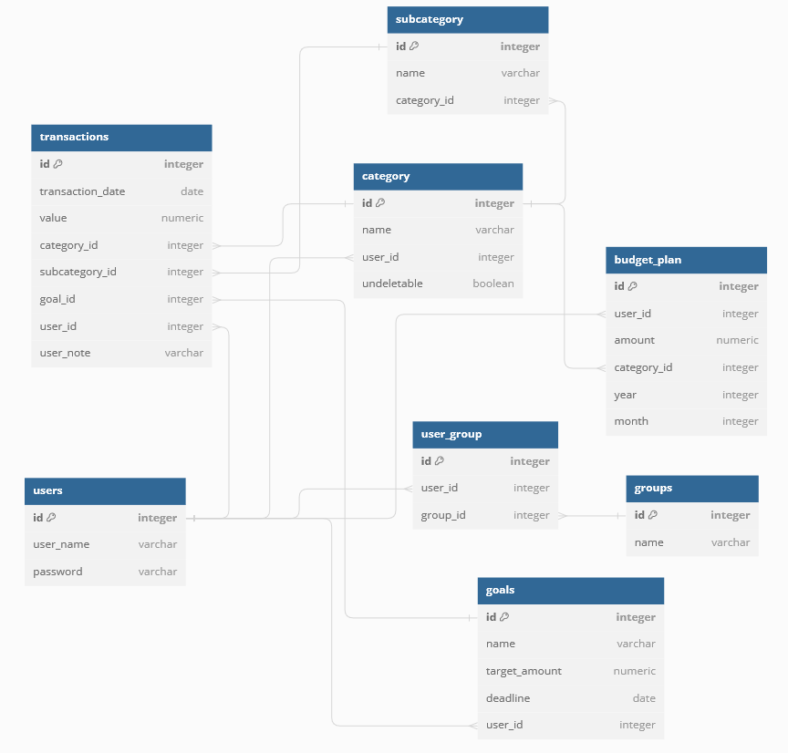

# HomeBudgetApp
Project Management university project. 

## About
Application for managing household budget. Application stores user's transactions history, display income/outcome statistics and many more. It's designed to improve group spending management. User needs to sign up and log in first to use application properly. 

## Functionalities
Basic functionalities of the application:
- Adding custom income/outcome categories
- Budget planning 
- Budget statistics (monthly and yearly)
- Creating groups for common budget 
- Informing about exceeding budget

Application not include:
- Mobile app 
- Reading transactions from the bank account

## Technology stack
- Python
- Postgres
- Sqlalchemy
- Flask

## Database architecture

## Running
- First run in cwd: `pip install -r requirements.txt`
- Then to run the flask server run this: `python run.py`
- After that go to http://127.0.0.1:5000 to use the application